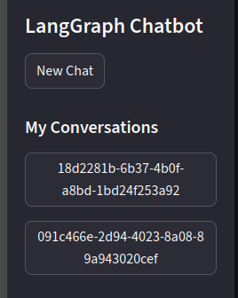
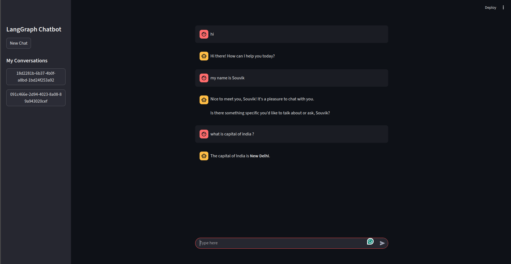

# LangGraph Chatbot

A conversational chatbot application built using **LangGraph**, **LangChain**, **Streamlit**, and **Google Generative AI (Gemini 2.5 Flash)**.  
It provides a simple interface for chatting, managing multiple conversation threads, and persisting chat history in a SQLite database.

---

## 📖 Description

LangGraph Chatbot is an interactive web-based chatbot that lets users:
- Start and manage multiple conversations.
- Persist chat history across sessions using **SQLite**.
- Leverage **Google Generative AI (Gemini)** for responses.
- Maintain context within each conversation thread.

It uses **LangGraph** for building the chatbot state machine, **Streamlit** for the frontend, and **SQLite** as a lightweight database for storing session states.

---

## ✨ Features

- 💬 **Chat Interface** – Intuitive Streamlit-based UI with message bubbles for user and assistant.
- 🧵 **Thread Management** – Each chat session gets a unique thread ID; users can switch between conversations.
- 💾 **Persistent Storage** – Conversation history is saved in SQLite (`chatbot.db`) via LangGraph’s `SqliteSaver`.
- 🤖 **AI-powered Responses** – Uses **Gemini-2.5-flash** model from Google Generative AI.
- 🔄 **Session State Handling** – Supports multiple chats without losing context.

---

## 🛠️ Implementation Details

### Backend (`langgraph_database_backend.py`)
- Implements the chatbot logic using **LangGraph**.
- Defines a `ChatState` with `messages` stored as LangChain message objects.
- Sets up a `chat_node` that invokes the **Gemini LLM**.
- Persists checkpoints using `SqliteSaver` with `chatbot.db`.
- Provides a function `retrieve_all_threads()` to fetch all conversation threads from the DB.

### Frontend (`streamlit_database_frontend.py`)
- Streamlit-based UI with:
  - Sidebar for **New Chat** and listing all previous conversations.
  - Main panel for displaying chat history.
  - Input box for sending user messages.
- Manages session state:
  - `message_history` for storing the conversation in the current session.
  - `thread_id` for active conversation context.
  - `chat_threads` for available conversation history.
- Sends user messages to the chatbot backend and streams assistant responses.

---

## 🚀 How to Run

### 1. Clone the Repository
```bash
git clone https://github.com/your-username/langgraph-chatbot.git
cd langgraph-chatbot
```

### 2. Install Dependencies
Make sure you have **Python 3.9+** installed. Then install requirements:
```bash
pip install -r requirements.txt
```

Example dependencies (`requirements.txt`):
```
streamlit
langchain
langgraph
langchain-google-genai
python-dotenv
sqlite3-binary
```

### 3. Set Up Environment Variables
Create a `.env` file with your **Google Generative AI API key**:
```
GOOGLE_API_KEY=your_api_key_here
```

### 4. Run the App
Start the Streamlit app:
```bash
streamlit run streamlit_database_frontend.py
```

### 5. Access the Chatbot
Open your browser at:
```
http://localhost:8501
```

---

## 📸 Screenshots

### Sidebar with Conversations


### Chat Interface


---

## 🔮 Future Enhancements
- Add user authentication for personalized chat history.
- Support for multiple LLMs (e.g., OpenAI GPT models).
- More advanced conversation titles instead of raw UUIDs.
- Export chat history as `.txt` or `.json`.

---

## 📜 License
This project is licensed under the MIT License.
